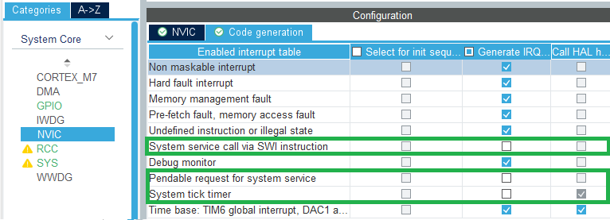

# STM32 FreeRTOS Manual Addition

Steps for manually adding FreeRTOS to an STM32CubeIDE project.

## 1. Timebase Source
Under `SYS`, set Timbase source to something other than `SysTick`, preferibly the basic timer `TIM6`. FreeRTOS uses the `SysTick` timer for its scheduler.

## 2. Disable IRQ generation
Under `NVIC`, disable code generation for 

* System service call via SWI instruction
* Pendable request for system service
* System tick timer

FreeRTOS defines its own handlers for these, and if CubeMX also generates handler functions then the linker will throw an error about multiple definitions.

## References
* https://dangerfromdeer.com/2020/11/17/setting-up-an-stm32f4-as-an-spi-device-with-freertos-and-stm32mxcube/
* https://vivonomicon.com/2018/08/23/bare-metal-stm32-programming-part-6-multitasking-with-freertos/
