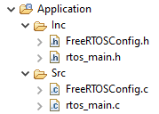

# STM32 FreeRTOS Manual Addition

Steps for manually adding FreeRTOS to an STM32CubeIDE project.

## 1. Change Timebase Source
Under `SYS`, set Timbase source to something other than `SysTick`, preferibly the basic timer `TIM6`. FreeRTOS uses the `SysTick` timer for its scheduler.

## 2. Disable IRQ generation
Under `NVIC`, disable code generation for 

* System service call via SWI instruction
* Pendable request for system service
* System tick timer

FreeRTOS defines its own handlers for these, and if CubeMX also generates handler functions then the linker will throw an error about multiple definitions.

## 3. Add FreeRTOS sources
Download FreeRTOS and copy the `Source` folder to the Cube workspace.
The relevant files in the `portable` folder are

* `heap4.c` from `MemMang`
* `port.c` and `portmacro.h` in the `GCC/ARM_CMxx` folder

## 4. Add FreeRTOS project configuration
Add the `FreeRTOSConfig` to the `Application/Src` and `Application/Inc` folder.

## 5. Add the FreeRTOS and Application folder to build paths
Under Project -> Properties, choose C/C++ General -> Paths and Symbols. Add The FreeRTOS and Application Inc folders.

## 6. Build and verify
After performing the above steps, the build *should* pass, and debugging *should* work.
The project in this git repository is for the [NUCLEO-F767ZI](https://www.st.com/en/evaluation-tools/nucleo-f767zi.html). Your milage may vary.

Good luck!

## References
* https://dangerfromdeer.com/2020/11/17/setting-up-an-stm32f4-as-an-spi-device-with-freertos-and-stm32mxcube/
* https://vivonomicon.com/2018/08/23/bare-metal-stm32-programming-part-6-multitasking-with-freertos/

